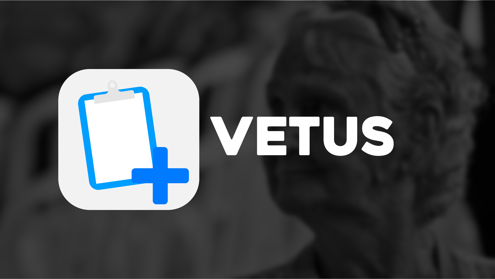

[![Contributors][contributors-shield]][contributors-url]
[![Issues][issues-shield]][issues-url]

<!-- PROJECT LOGO -->
 

  
  

<!-- TABLE OF CONTENTS -->

  
Table of Contents

  <ol>
    <li>
      <a href="#about-the-project">About The Project</a>
      <ul>
        <li><a href="#built-with">Built With</a></li>
      </ul>
    </li>
    <li><a href="#contributing">Contributing</a></li>
    <li><a href="#contact">Contact</a></li>
    <li><a href="#acknowledgments">Acknowledgments</a></li>
  </ol>

<!-- ABOUT THE PROJECT -->
## ¿Qué es VETUS?

[![Product Name Screen Shot][product-screenshot]](https://example.com)

Para geriatras que requieran agilizar sus trabajos, Vetus se trata de una aplicación que busca realizar pruebas comunmente aplicadas a pacientes para determinar su estado de salud de manera más interactiva, cercana y veloz, recopilando la información obtenida además de agregar otras características que puedan convertir lo que sería una cita al médico complicada y cansada a algo mucho más fácil y cómodo.

(<a href="#top">back to top</a>)

## Built with

* [Unity](https://unity.com/es)

(<a href="#top">back to top</a>)

<!-- CONTACT -->
## Contributors and information

Ciclo 1. Base de datos

Construcción de software y toma de decisiones (Gpo 400) | TC2005B.400

Tecnológico de Monterrey - Campus Guadalajara

Álvaro Misael Pintor Alcántar - [@XxMaziozarexX](https://github.com/XxMaziozarexX) - A01631795

Carla Morales López - [@moraleslc](https://github.com/moraleslc) - A01639225

José Abraham González Navarro - [@abrahamglez17](https://github.com/abrahamglez17) - A00369832

José Angel Tobón Salazar - [@JoseTobon](https://github.com/JoseTobon) - A01411655

Juan Pablo Montoya Estévez - [@JuanPabloMontoya271](https://github.com/JuanPabloMontoya271) - A01251887

León Emiliano García Pérez - [@LeonEGP](https://github.com/LeonEGP) - A00573074

Siddhartha López Valenzuela - [@SiddLopez](https://github.com/SiddLopez) - A00227694

Link del proyecto: [https://github.com/JoseTobon/VETUS](https://github.com/JoseTobon/VETUS)

(<a href="#top">back to top</a>)

<!-- ACKNOWLEDGMENTS -->
## Acknowledgments

Documentos, recursos, código, imágenes, entre otros usados en Aergio:

* [Imagen header](https://unsplash.com/photos/z_8Jqe0Cc-s)
* [Shields](https://shields.io/)
* [Best-README-Template](https://github.com/othneildrew/Best-README-Template)

(<a href="#top">back to top</a>)

<!-- MARKDOWN LINKS & IMAGES -->
<!-- https://www.markdownguide.org/basic-syntax/#reference-style-links -->
[contributors-shield]: https://img.shields.io/badge/contributors-2-green
[contributors-url]: https://github.com/JoseTobon/VETUS/graphs/contributors
[issues-shield]: https://img.shields.io/github/issues/JoseTobon/VETUS
[issues-url]: https://github.com/JoseTobon/VETUS/issues
[product-screenshot]: images/screenshot.png